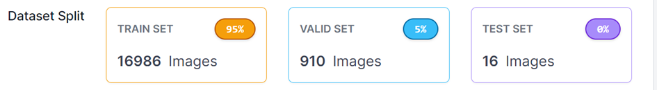

Habe augmentations auf den Datensatz gemacht.
Sind nun viel mehr Bilder.
Mit default Einstellungen 100 Epochs trainiert.


```
!python train.py \
--data 'data.yaml' \
--weights yolov5m.pt \
--img 640 \
--epochs 100 \
--batch-size 64 \
--cfg 'models/yolov5m.yaml' \
--cache disk \
--device 0
```